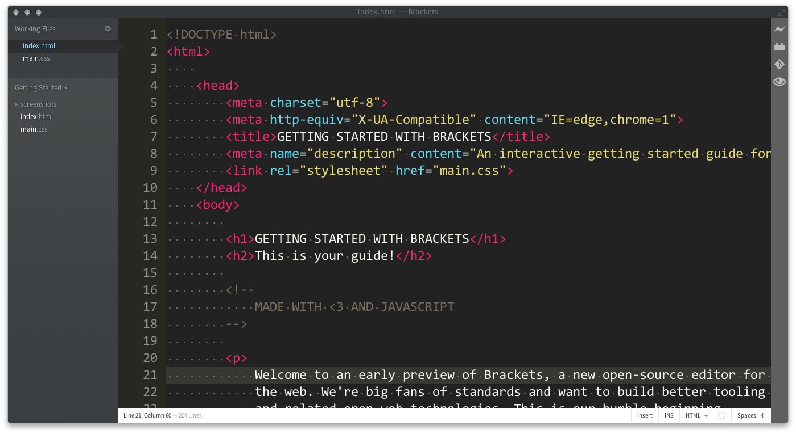

Brackets Theme: Monokai
===

This theme is based on the _monokai_ color scheme from [Sublime Text](http://sublimetext.com/).

Screenshot
---

Installation
---

This extension requires Brackets Release 42 or newer.

1. Open Brackets
2. Open the extension manager
3. Search for ‘Monokai’
4. Click install

License
---

The MIT License. Read [LICENSE](LICENSE) for further information.